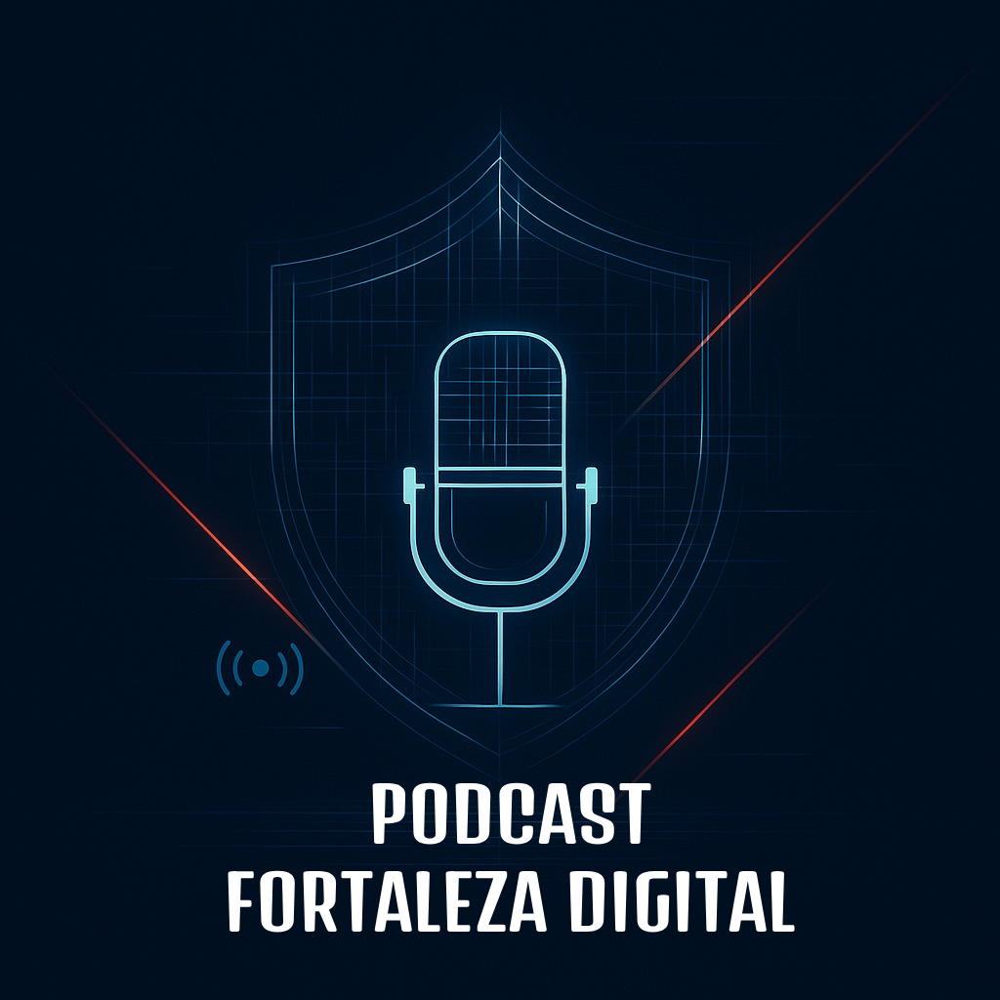

<h1 align="center">
  Podcast - Cyber: Fortaleza Digital
</h1>

  

  <strong>A Guerra Invisível pelo Futuro Financeiro</strong>

  
  
  

---

## 📝 Sobre o Projeto

> Este projeto foi desenvolvido como uma solução original para o desafio de criação de podcast com IA da DIO. O foco foi explorar os desafios estratégicos da **cibersegurança no setor bancário**, um tema de alta relevância para instituições como o Santander.

O podcast simula um diálogo entre uma apresentadora e um especialista em Cyber, discutindo ameaças modernas como engenharia social, ataques à cadeia de suprimentos e a mudança de paradigma da segurança, de um centro de custo para um **habilitador de negócios e inovação**.

---

## 💻 Ferramentas e Decisões Estratégicas

A seleção de ferramentas para este projeto foi guiada por critérios de eficiência, integração e acessibilidade, resultando em um fluxo de trabalho otimizado dentro de um ecossistema coeso.

* **[Obsidian.md](https://obsidian.md/):** Organização e roteirização em um ambiente local e offline.
* **[Google Gemini](https://gemini.google.com/):** Geração de texto (nomes), arte da capa e narração (TTS).
* **[CapCut](https://www.capcut.com/pt-br/):** Edição e finalização de áudio com múltiplas trilhas e efeitos.

---

## ✨ Como Foi Feito?

O podcast foi criado seguindo uma esteira de produção que combina estratégia humana com a potência da IA Generativa:

1.  **Branding e Identidade:** Geração do nome e da arte da capa via IA para criar uma marca forte e profissional.
2.  **Criação do Roteiro:** Desenvolvimento de um roteiro original e colaborativo para garantir profundidade e impacto.
3.  **Narração com IA:** Uso do Gemini Speech para gerar as duas vozes do diálogo de forma clara e realista.
4.  **Pós-produção:** Edição do áudio no CapCut para montar o diálogo, adicionar a trilha sonora e os efeitos sonoros.

---

## 📂 Conteúdo do Repositório

* **/prompts:** Contém os prompts originais utilizados para gerar o nome do podcast e a arte da capa.
* **/scripts:** O roteiro completo do episódio, formatado para consulta.
* **/assets:** A capa do podcast gerada por IA.
* **/output:** O arquivo final `podcast_editado.mp3`, pronto para ouvir.

---

## 👨‍💻 Autor

| [ Paulo  G.  Werneck](https://github.com/5kr1pt) |
| :--------------------------------------------------------------------------------------------------------------------------------------: |

Feito por Paulo G. Werneck.

